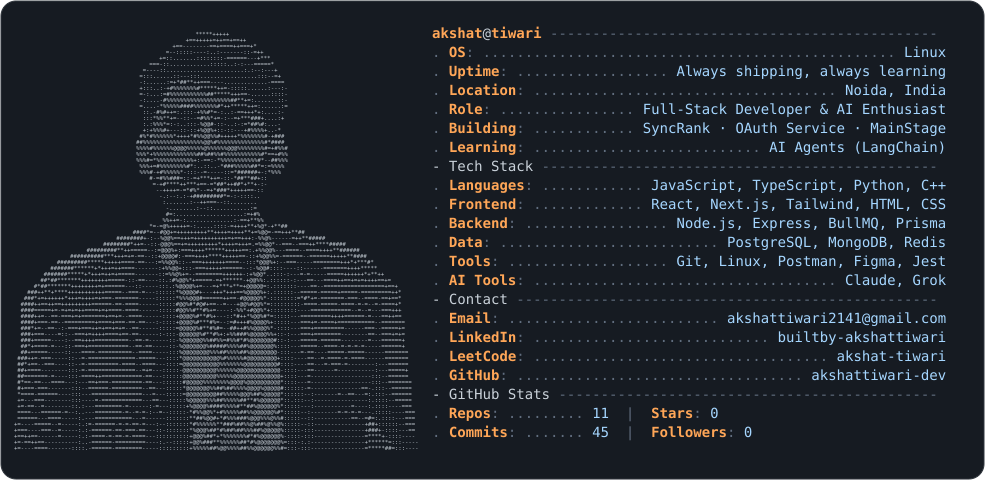

<!-- ╔══════════════════════════════════════════════════════════════════╗
     ║  1. ASCII CARD (auto-updating, switches with GitHub dark/light)  ║
     ╚══════════════════════════════════════════════════════════════════╝ -->

  <picture>
    <source media="(prefers-color-scheme: dark)" srcset="./dark_mode.svg">
    <source media="(prefers-color-scheme: light)" srcset="./light_mode.svg">
    
  </picture>

<!-- ╔══════════════════════════════════════════════════════════════════╗
     ║  2. PROFILE BODY                                                 ║
     ╚══════════════════════════════════════════════════════════════════╝ -->
<h1 align="center">Hi there, I'm Akshat Tiwari 👋</h1>

<h3 align="center">Full-Stack Developer | AI Enthusiast · React.js · Next.js · Node.js | Learning by building</h3>

  

  
  
  
  <!-- ✏️ TODO 1: replace PORTFOLIO_LINK with your portfolio URL -->
 
  <!-- ✏️ TODO 2: replace RESUME_LINK with your resume URL -->
  

## 👨‍💻 About Me

- 💼 Full-Stack Developer building with the MERN stack and TypeScript
- 🚧 Currently building **SyncRank**, an **OAuth service**, and **MainStage**
- 🤖 Learning AI and exploring agentic workflows with LangChain
- 🧩 Sharpening problem solving on [LeetCode](https://leetcode.com/u/akshat-tiwari/)
- 🤝 Open to collaborating on full-stack and AI projects
- 💬 Ask me about React.js, Next.js, Node.js, Redis, BullMQ, and building for scale
- 📄 Resume: [view here](RESUME_LINK) <!-- ✏️ TODO 3: same resume URL -->

## 🛠️ Tech Stack

**Languages** 

**Frontend** 

**Backend & Data** 

**Tools** 

<table>
  <tr>
    <td width="50%" valign="top">
      <h3>📊 GitHub Stats</h3>
      <picture>
        <source media="(prefers-color-scheme: dark)" srcset="https://streak-stats.demolab.com?user=akshattiwari-dev&hide_border=true&theme=github-dark-blue">
        
      </picture> 
      
    </td>
    <td width="50%" valign="top">
      <h3>📅 Isometric Commit Calendar</h3>
      
    </td>
  </tr>
  <tr>
    <td width="50%" valign="top">
      <h3>🏆 Achievements</h3>
      
    </td>
    <td width="50%" valign="top">
      <h3>🚀 Website Performance</h3>
      <!-- Needs your portfolio URL in .github/workflows/metrics.yml. No site yet? Delete this whole <td>. -->
      
    </td>
  </tr>
</table>

## 📌 Starred Topics

## 🚀 Featured Projects

| Project | What it is | Status |
| :-- | :-- | :-- |
| [**SyncRank**](https://github.com/akshattiwari-dev/_Syncrank) | TypeScript project | 🚧 In progress |
| [**OAuth Service**](https://github.com/akshattiwari-dev/o-authservice) | Authentication service | 🚧 In progress |
| [**Reputechain**](https://github.com/akshattiwari-dev/Reputechain) | TypeScript project | ✅ Built |
| [**Agentic LangChain**](https://github.com/akshattiwari-dev/Agentic-langchain) | AI agents with LangChain | 🧪 Learning |
| [**Portfolio**](https://github.com/akshattiwari-dev/akshatportfolio-newai-) | Personal portfolio | ✅ Built |

 
## 🎓 AI Certifications
 
<!-- ✏️ TODO: replace each CERT_*/ISSUER_*/YEAR_*/LINK_* below with your real certificate details.
     Delete any extra rows. Use the verification link from Credly / Coursera / Google / DeepLearning.AI etc. -->
 
| Certificate | Issued by | Year | Proof |
| :-- | :-- | :-- | :-- |
| Introduction to Artificial Intelligence| infosys |  [View credential](https://verify.onwingspan.com) |
|  Introduction to Deep Learning|  infosys |[View credential](https://verify.onwingspan.com) |
| Computer Vision 101  | infosys |  [View credential](https://verify.onwingspan.com) |

<i>Thanks for stopping by — let’s build something impactful together 🚀</i>

